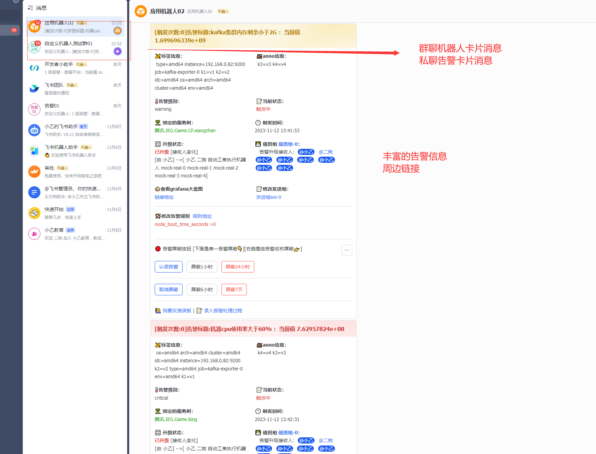
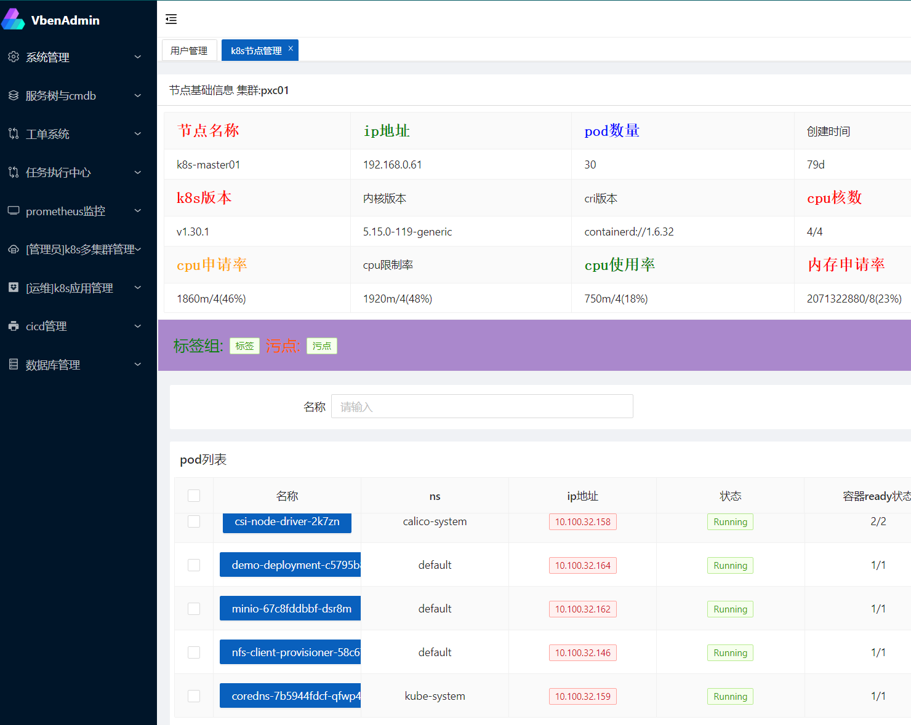
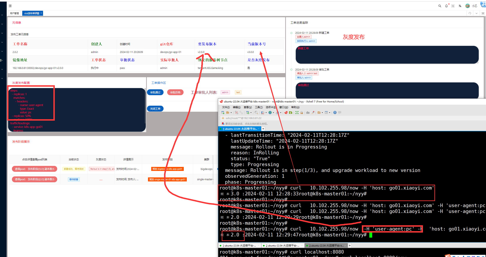
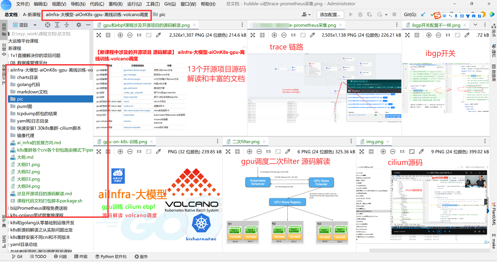
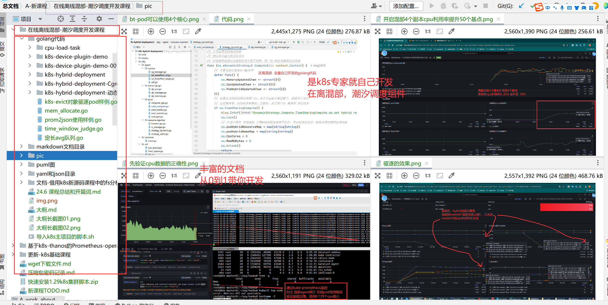
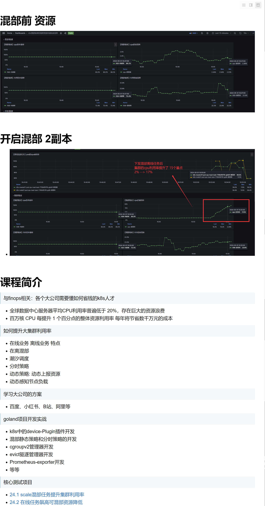
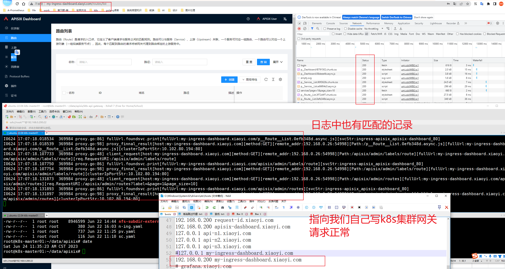

# k8s运维解决方案
# k8s多集群管理
# 高可用Prometheus集群架构
# 灰度发布


# <font color=red>专注 k8s/监控/cicd/微服务整理/golang 基础架构解决方案</font>
- 这几个方向的集群运维，组件选型，开发都可以
- 有需求+v `mxy1875` 沟通


# 个人简介
- [抖音：小乙运维杂货铺](https://v.douyin.com/ihNX2nKx/)
- [github:ning1875](https://github.com/ning1875)
- [b站](https://space.bilibili.com/278569661)
- [知乎](https://www.zhihu.com/people/lang-zi-yan-qing-yan-xiao-yi-62/posts)


## 核心优势 ：k8s/prometheus/cicd/golang运维开发专家
- 精通k8s源码：解决各种k8s底层疑难杂症、k8s大集群调优、containerd底层问题等
- 从2个角度系统的研究过k8s源码，总结[2个k8s源码课程](https://haohuo.jinritemai.com/ecommerce/trade/detail/index.html?id=3669946874917421381&origin_type=604) (按组件、从一个具体问题入手)
- 独立开发30+k8s周边项目：多集群自动守卫、operator、定制调度器、webhook、各种ds等
- k8s在线离线没有短板，离线训练：aiOnK8s、aiInfra、volcano等
- 在线集群：稳定性保障、流量控制、集群网关apisix、多泳道等
- k8s资源利用率：超卖、应用资源画像、在离混部-潮汐调度等
- 监控架构：我可以将监控系统带到一个新的高度，熟读prometheus和周边项目源码，已多次给人培训并贡献多个开源项目
- 监控底层：开发20+的exporter，维护各种tsdb、thanos、重查询提速、动态分片的HA等
- cicd：独立设计完整的多环境多泳道发布流程、熟悉各种pipeLine工具源码tekton、argocd、kruise-rollout等
- golang: 丰富的运维平台和工具开发经验，[独立设计并开发8模块前后端大运维平台](https://www.bilibili.com/video/BV1j2421c7ac) (工单、cmdb和服务树、grpc-cs任务执行、监控、k8s、cicd、巡检、日志监控、分布式网络探测)


# 成功案例介绍 8模块大运维平台
- 介绍
```shell

课程介绍
【课程形式】2000集录播教程视频(持续更新)+直播答疑
【自己一人用golang+vue3实现8模块golang大运维平台前后端全部代码】
【后端golang代码4万行】【60+张mysql表】
【8模块详情如下】
模块01-前后端底座
模块02-服务树和CMDB
模块03-自助工单
模块04-任务执行中心-grpc-server/agent
模块05-prometheus监控平台
模块06-k8s多集群和APP管理
模块07-cicd平台和灰度发布
模块08-数据库和SQL管理平台
----
学习前的门槛：golang基础+前端0基础即可
```
- 
- 
- 

# 成功案例介绍 gpuOnk8s volcano ai训练推理
```shell
【让运维搭上AI大模型的风口】，gpuOnk8s 实战搭建和go开发，源码解读，原理讲解
【感兴趣的私聊】
gpuOnk8s，gpu虚拟化、gpu监控、gpu多k8s集群管理，gpu坏卡自动守卫
高性能-roce组网rdma网卡
内核ebpf和cilium
volcano调度和 gpu虚拟化、dp和调度器开发
```
- 


# 成功案例介绍  k8s集群 在离混部 潮汐调度
- 简介
```shell
【是k8s专家就自己用golang实现 k8s在离混部 潮汐调度组件】，感兴趣的私聊
- 整机分时复用，潮汐调度
- 动态资源分配和隔离：根据在线业务的负载，动态调整分配给离线业务的资源量，动态执行资源隔离策略
- 动态资源感知，轻松提升集群cpu利用率20个基点
- 混部cgroupv2资源大框
- 资源波动驱逐管理器
```
- 
- 


# 成功案例介绍   apisix网关改造下线istio
- 
```shell
【是k8s专家就自己用golang实现一套ingress控制器和集群网关】

- 目的不是完成一个非常厉害的控制器：(降级、多分支泳道 对接灰度/蓝绿发布)难度比较高
- 更多的是在于在go源码级别让你更好的理解 ingress控制器的工作流程
- 有助于排查底层istio/apisix的问题


【掌握ingress/istio/apisix等网关源码还不能】
# 一般的公司k8s集群流量网关重要性
- 业务模式是在线服务 流量网关的建设是重点
# 网关的核心点
- 网站流量入口、http/grpc流量
- 控制面配置，如何对接服务发现
- 转发规则、降级、多分支泳道
- 对接灰度/蓝绿发布
- ingress-nginx/istio源码解析

```

